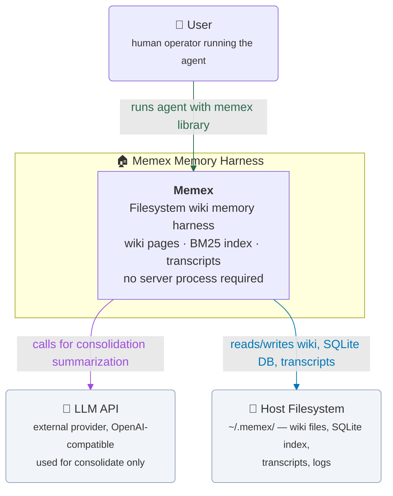
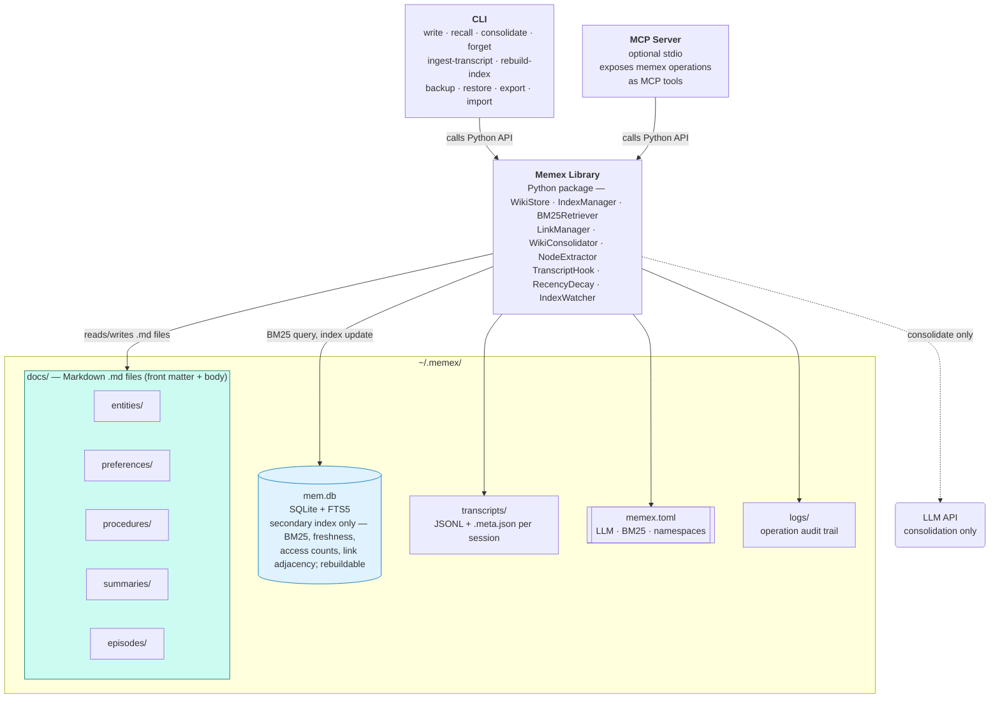
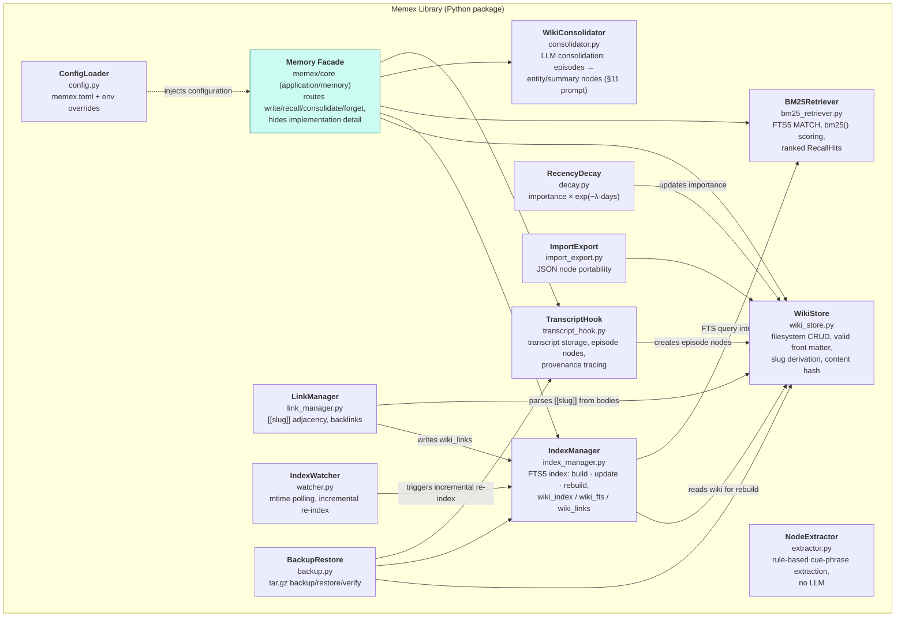
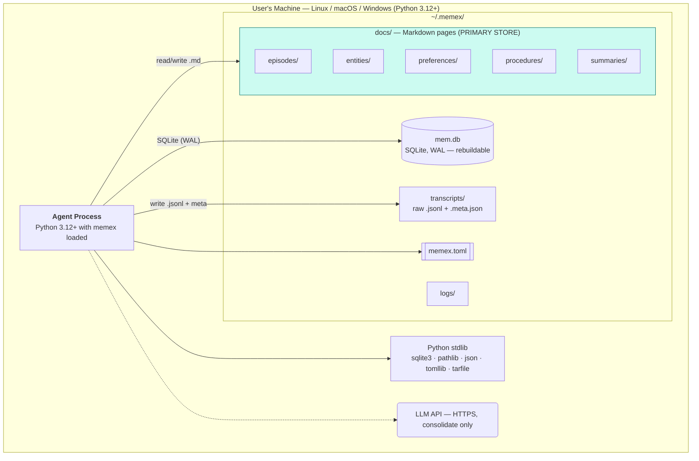

# Specification — Filesystem Wiki Memory Harness (`memex`)

**Ward:** `research-and-specification`
**Design document:** `pages/memory-harness-design.md`
**Evidence base:** `pages/fact-check-peer-reviewed.md` (36 verified-technical claim verdicts)
**Comparison:** `.zbot/specs/agent-memory-harness/spec.md` (hybrid BM25+vector variant); `.zbot/specs/agent-memory-harness-node-wiki/spec.md` (SQLite-node variant)

---

## OKF v0.2 Front Matter

```yaml
okf_version: "0.2"
type: "Spec"
title: "Memex — Filesystem Wiki Memory Harness"
description: >-
  Filesystem-based agent memory harness where the wiki IS the filesystem.
  Wiki pages are real Markdown files under ~/.memex/docs/, human-readable,
  git-able, and editable by hand. SQLite (mem.db) is a rebuildable secondary
  index providing BM25 full-text retrieval and freshness tracking only.
  Transcript hooks store raw conversation logs and link them to episode nodes
  for full provenance tracing. No vector embeddings. No graph database.
  No cloud. No server process.
resource: ".zbot/specs/memex/spec.md"
tags:
  - research-and-specification
  - spec
  - agent-memory
  - filesystem-wiki
  - bm25-only
  - llm-as-wiki
  - architecture-diagrams
  - okf-v0.2
  - memex
  - transcript-hooks
  - local-first
  - zero-dependency
timestamp: "2026-09-15T00:00:00Z"
spec_version: "1.0.0"
status: "build-ready"
variant: "filesystem-wiki"
parent_spec: ".zbot/specs/agent-memory-harness-node-wiki/spec.md"
grandparent_spec: ".zbot/specs/agent-memory-harness/spec.md"
evidence_base: "pages/fact-check-peer-reviewed.md"
design_doc: "pages/memory-harness-design.md"
language: "python"
min_python: "3.12"
dependencies: "zero-required"
license: "Apache-2.0"
build_time_estimate: "6-8 hours"
acceptance_tests: 21
arch_diagrams: "mermaid"
index_rebuildable: true
index_primary: false
wiki_primary: true
transcript_support: true
```

---

> **Terminology note (post-build, v0.2+).** This specification was
> authored against the original "wiki" naming. The shipped product
> renamed the storage concepts: pages live under `~/.memex/docs/` (not
> `wiki/`), the config section is `[pages]` (legacy `[wiki]` still
> accepted), and transcripts carry identity only with token accounting
> in the `.meta.json` sidecar. Where this document says "wiki", read the
> filesystem memory store. See the [user guide](guide.md) for current
> behavior and [implementation notes](implementation-notes.md) for every
> deviation.

## 1. Objective

**Memex** is a filesystem-based, node-driven, LLM-as-wiki agent memory harness.
The fundamental design principle is: **the wiki is the filesystem**. Every memory
node is a real Markdown file under `~/.memex/docs/`. The files are human-readable,
git-able, and editable by hand with any text editor. There is no SQLite node store,
no BLOB column, and no binary format.

SQLite (`~/.memex/mem.db`) is a **secondary index only**. It mirrors wiki content
to provide fast BM25 full-text retrieval and to track freshness metadata
(last modified, access count, link adjacency). If `mem.db` is deleted, it can be
fully rebuilt by scanning the wiki directory.

The system provides four core operations — `write`, `recall`, `consolidate`, `forget` —
plus transcript hooks, a CLI, an optional MCP server, and backup/restore. All
transcript files (raw conversation logs) are stored under `~/.memex/transcripts/`
and linked to episode nodes, enabling full provenance tracing from any wiki page
back to the originating conversation.

**Success condition:** an agent process that exits and restarts can recall a fact
written in the previous session by querying the filesystem wiki, with no server,
no cloud account, no required third-party pip dependency, and with full transcript
provenance for every stored fact.

---

## 2. Scope and Non-Goals

### 2.1 In scope

- Single-user, single-machine, local-first persistence.
- Wiki pages as filesystem Markdown files (`~/.memex/docs/*.md`).
- SQLite as a rebuildable secondary index with FTS5 BM25 retrieval.
- Node types: **entity**, **preference**, **procedure**, **summary**, **episode**.
- Four operations: `write`, `recall`, `consolidate`, `forget`.
- Transcript hooks: raw transcript storage, episode linking, provenance tracing.
- File-watching index updates via modification timestamp polling (no inotify).
- Index rebuild command: `memex rebuild-index`.
- Backup and restore: `memex backup` / `memex restore`.
- Concurrent access safety via SQLite WAL mode.
- C4 architecture diagrams (all four levels in Mermaid).
- A Python API, a CLI, and an optional stdio MCP server.
- Import / export of wiki nodes as JSON for backup and migration.
- `[[wiki-link]]` slug syntax for cross-references within wiki body text.

### 2.2 Explicit exclusions (scope boundary)

| Excluded feature | Justification | Evidence |
|---|---|---|
| **Vector / embedding / cosine retrieval** | Not in the design mandate; BM25 suffices for lexical retrieval. | C017 (supported, preprint): retrieval-on-demand does not require embeddings; BM25 is a viable baseline |
| **Graph database** | Excluded from design; memex uses the filesystem directory tree as the node graph, not a separate graph DB. | C061 (unverifiable for source system) |
| **Cloud / hosted deployment** | Requires a managed database and a running service process. Zero-cloud is an explicitly valued design property of the reference system. | `[pragmatic]` |
| **Multi-user / multi-agent sync** | The sync protocol, conflict resolution, and relay server add substantial complexity. No peer-reviewed benchmark validates that multi-agent memory sync improves single-user task performance. | `[pragmatic]` |
| **Server process** | Memex is a library and CLI tool, not a daemon. No background service required. | `[pragmatic]` |
| **Inotify / filesystem notification daemon** | Cross-platform compatibility; timestamp polling on access is sufficient for index freshness. | `[pragmatic]` |
| **LLM-dependent consolidation (auto-summarization without agent input)** | Consolidation via LLM summarization requires a model call on every session end. Tool-calling LLMs are not universally available. The LLM is called only when the agent explicitly invokes consolidate. | C077 (supported, preprint) |
| **Trust / provenance tiers (STATED / IMPORTED / DERIVED)** | Prompt-injection defense, not validated by peer-reviewed literature for memory retrieval. | `[pragmatic]` |
| **Cross-encoder re-ranking** | Requires a second model call over top-k candidates; excluded from minimal. | `[pragmatic]` |
| **Markdown rendering / web UI** | Wiki is plain Markdown files; rendering is the user's choice (Obsidian, VS Code, git web viewer). | `[pragmatic]` |

---

## 3. Architecture Diagrams

All four levels (context, container, component, deployment) as Mermaid
flowcharts that render on GitHub and the docs site.

### Level 1 — System Context



### Level 2 — Container



### Level 3 — Component



### Level 4 — Deployment



---

## 4. Inputs with Schemas

### 4.1 Turn Stream (JSONL) — Primary Input

Every conversation turn is written to a transcript file and optionally used to
extract memory nodes.

```json
// Line format: one JSON object per line
{"role": "user", "content": "I prefer using ruff for linting", "ts": "2026-09-15T10:00:00Z", "turn": 1}
{"role": "agent", "content": "I'll configure ruff as the linter.", "ts": "2026-09-15T10:00:01Z", "turn": 2}
{"role": "tool", "tool_name": "shell", "result": "✓ ruff installed", "ts": "2026-09-15T10:00:02Z", "turn": 3}
```

**Schema:**

```python
TurnStreamEntry = {
    "role": Literal["user", "agent", "tool"],
    "content": str,                          # Turn text
    "ts": str,                               # ISO8601 UTC timestamp
    "turn": int,                             # Turn number within session
    "tool_name"?: str,                      # Only for role="tool"
    "result"?: str,                          # Only for role="tool"
    "query"?: str,                           # Optional: the tool call query
}
```

### 4.2 Explicit Wiki Page Write

```python
WriteInput = {
    "type":    Literal["entity", "preference", "procedure", "summary", "episode"],
    "title":   str,                          # Human-readable title
    "body":    str,                          # Markdown body (may contain [[slug]] links)
    "tags":    list[str] = [],
    "importance": float = 0.5,               # [0.0, 1.0]
    "links"?:  list[str] = [],              # Explicit slug list (LinkManager infers the rest)
    "session_id"?: str,                      # Required for type="episode"
    "transcript_ref"?: str,                 # Path to transcript file (episode nodes only)
    "expires_at"?: str | None = None,       # ISO8601 or null
    "valid_from"?: str | None = None,        # ISO8601 or null
    "valid_to"?: str | None = None,          # ISO8601 or null
}
```

### 4.3 Consolidation Trigger

```python
ConsolidateInput = {
    "mode": Literal["full", "dry-run"],      # full = write new nodes; dry-run = return LLM output only
    "episode_ids"?: list[str],               # Specific episode node IDs to consolidate (default: all recent)
    "max_episodes"?: int = 10,              # Limit to N most recent episodes
    "include_links"?: bool = True,          # Whether to include [[wiki-link]] in generated content
}
```

### 4.4 Transcript Ingest

```python
IngestTranscriptInput = {
    "session_id": str,                       # Unique session identifier (e.g., "sess-abc123")
    "turns": list[TurnStreamEntry],         # List of conversation turns
    "metadata"?: dict = {},                  # Optional: agent_version, user_id, tags
}
```

### 4.5 Configuration File (memex.toml)

```python
MemexConfig = {
    "app_name": str = "memex",              # Directory name under ~
    "data_dir": Path,                        # ~/.memex/ (computed from app_name)
    "llm": {
        "provider": Literal["openai", "anthropic", "ollama", "lmstudio"] = "openai",
        "model": str = "gpt-4o",
        "api_base": str = "https://api.openai.com/v1",
        "api_key"?: str,                     # Or set via MEMEX_API_KEY env var
        "timeout": int = 60,                 # Seconds
        "max_tokens": int = 4096,
    },
    "bm25": {
        "k1": float = 1.5,                   # BM25 term frequency saturation
        "b": float = 0.75,                   # BM25 document length normalization
        "default_top_k": int = 10,
    },
    "recency_decay": {
        "enabled": bool = True,
        "half_life_days": int = 30,          # Importance halves every N days without access
    },
    "index": {
        "watch_poll_interval": int = 60,      # Seconds between IndexWatcher polls (0 to disable)
        "auto_rebuild_on_startup": bool = False,
    },
    "wiki": {
        "default_importance": float = 0.5,
        "max_body_chars": int = 50000,       # Warn if body exceeds this
        "slug_algo": Literal["kebab", "sha1"] = "kebab",  # How to derive slugs from titles
    },
    "logging": {
        "level": Literal["DEBUG", "INFO", "WARNING", "ERROR"] = "INFO",
        "file": Path = "~/.memex/logs/memex.log",
    },
}
```

---

## 5. Outputs with Schemas

### 5.1 Recall Results

```python
RecallHit = {
    "slug": str,                             # Wiki file slug (filename without .md)
    "file_path": str,                        # Absolute path to the .md file
    "title": str,
    "node_type": Literal["entity", "preference", "procedure", "summary", "episode"],
    "importance": float,
    "score": float,                          # BM25 score
    "rank": int,                             # 1-based rank
    "snippet": str,                          # Text snippet with query terms highlighted
    "snippet_source": Literal["body", "title"],  # Where the snippet came from
    "tags": list[str],
    "created": str,                           # ISO8601
    "updated": str,                           # ISO8601
    "last_access": str,                       # ISO8601
    "transcript_ref"?: str,                  # Only for episode nodes
    "links": list[str],                      # [[slug]] outgoing links
}

RecallResult = {
    "query": str,
    "hits": list[RecallHit],
    "total_indexed": int,                    # Total nodes in index
    "search_engine": Literal["bm25"],        # Always "bm25" for memex
    "search_time_ms": float,
}
```

### 5.2 Consolidation Report

```python
ConsolidationReport = {
    "mode": Literal["full", "dry-run"],
    "episodes_processed": int,
    "nodes_created": list[WriteInput],       # The new wiki nodes that were (or would be) written
    "nodes_updated": list[str],              # Slugs of existing nodes that were updated
    "links_added": int,                      # [[slug]] cross-references added
    "llm_calls": int,
    "llm_prompt_tokens": int,
    "llm_completion_tokens": int,
    "dry_run": bool,
}
```

### 5.3 Transcript Link Report

```python
TranscriptLinkReport = {
    "session_id": str,
    "transcript_file": str,                   # Path to .jsonl transcript
    "meta_file": str,                         # Path to .meta.json metadata
    "episode_node": str,                      # Slug of the created episode wiki node
    "episode_file_path": str,                 # Absolute path to episode .md file
    "turn_count": int,
    "user_turns": int,
    "agent_turns": int,
    "tool_turns": int,
}
```

### 5.4 Context Window Injection Format

Ready for direct injection into an LLM prompt:

```
=== memex MEMORY ===
[Search: "<query>"]
---
1. <title> (<node_type>) | importance: <importance> | updated: <updated>
   File: <file_path>
   <snippet>
   Tags: <tags>
   Links: <links>
---
[repeated for each hit, up to top_k]
=== END memex MEMORY ===
```

### 5.5 Wiki Page Export

```json
{
  "version": "1.0",
  "exported_at": "2026-09-15T00:00:00Z",
  "nodes": [
    {
      "slug": "ruff-linter",
      "type": "entity",
      "title": "Ruff linter",
      "tags": ["tool", "linter"],
      "importance": 0.8,
      "created": "2026-09-15T10:00:00Z",
      "updated": "2026-09-15T12:00:00Z",
      "body": "...",
      "links": ["python-3-11", "project-tooling"],
      "transcript_ref": null
    }
  ]
}
```

---

## 6. Data Model

### 6.1 Wiki File Format

Every wiki `.md` file has YAML front matter followed by Markdown body text.
The filesystem path determines the node type:

```
~/.memex/docs/{type}/{slug}.md
```

Where `type` ∈ {entities, preferences, procedures, summaries, episodes}
and `slug` is a kebab-cased identifier derived from the title.

**Complete wiki file structure:**

```markdown
---
id: "a1b2c3d4-e5f6-7890-abcd-ef1234567890"
type: "entity"          # entity | preference | procedure | summary | episode
title: "Ruff linter"
tags: ["tool", "linter", "python"]
importance: 0.8
created: "2026-09-15T10:00:00Z"
updated: "2026-09-15T12:00:00Z"
access_count: 7
last_access: "2026-09-15T14:30:00Z"
expires_at: null         # ISO8601 or null
valid_from: "2026-09-15T10:00:00Z"
valid_to: null           # ISO8601 or null
transcript_ref: null     # Path relative to ~/.memex/ (only for episode nodes)
links: ["python-3-11", "project-tooling"]   # Outgoing [[slug]] references
content_hash: "sha256:abc123..."  # SHA-256 of body text (for change detection)
---
# Ruff linter

Ruff is a fast Python linter and formatter written in Rust. It replaces
flake8, isort, and black in a single tool.

**Why it matters:** Ruff is 10-100x faster than flake8.

Related: [[python-3-11]], [[project-tooling]]

## Usage

```bash
ruff check .
ruff format .
```

See also: [[ruff-config]], [[python-tooling-2026]]
```

**Slug derivation algorithm (kebab case):**
1. Lowercase the title
2. Replace all non-alphanumeric characters (except hyphens) with hyphens
3. Collapse multiple consecutive hyphens into one
4. Strip leading/trailing hyphens
5. Truncate to 64 characters if needed
6. If empty, derive from `id[:8]` (first 8 hex chars of UUID)

**Link format:** `[[slug]]` in body text. Slugs are matched case-insensitively.
The `links` array in front matter is the canonical outgoing link list, computed
by parsing the body text. The body may also contain links not in the `links` array
if they are added manually — the `links` array is updated by LinkManager on write.

### 6.2 SQLite mem.db — Secondary Index DDL

The database is **never the source of truth**. It is a rebuildable index.

```sql
-- schema_version: tracks which migration level the DB is at
CREATE TABLE IF NOT EXISTS index_meta (
    key    TEXT PRIMARY KEY,
    value  TEXT NOT NULL
);
-- key='schema_version'  → '1'
-- key='last_index_rebuild' → ISO8601 timestamp
-- key='wiki_file_count'  → integer count
-- key='memex_version'   → '1.0.0'

-- Main wiki content index
CREATE TABLE IF NOT EXISTS wiki_index (
    id            TEXT PRIMARY KEY,       -- UUID from front matter
    slug          TEXT UNIQUE NOT NULL,   -- kebab-case filename stem
    file_path     TEXT UNIQUE NOT NULL,   -- Absolute path to .md file
    title         TEXT NOT NULL,
    node_type     TEXT NOT NULL,          -- entity | preference | procedure | summary | episode
    importance    REAL NOT NULL DEFAULT 0.5,
    tags          TEXT NOT NULL DEFAULT '[]',   -- JSON array
    created       TEXT NOT NULL,          -- ISO8601
    updated       TEXT NOT NULL,          -- ISO8601
    access_count  INTEGER NOT NULL DEFAULT 0,
    last_access   TEXT,                    -- ISO8601 or null
    expires_at     TEXT,                    -- ISO8601 or null
    valid_from     TEXT,                    -- ISO8601 or null
    valid_to       TEXT,                    -- ISO8601 or null
    content_hash   TEXT NOT NULL,          -- SHA-256 of body text
    transcript_ref TEXT                     -- Relative path to transcript (episode nodes only)
);

-- FTS5 virtual table for BM25 full-text search
-- Tokenizes title and body from wiki_index rows
CREATE VIRTUAL TABLE IF NOT EXISTS wiki_fts USING fts5(
    slug,
    title,
    body,
    tags,
    content='wiki_index',
    content_rowid='rowid',
    tokenize='porter unicode61'
);

-- Triggers to keep wiki_fts in sync with wiki_index
CREATE TRIGGER IF NOT EXISTS wiki_index_ai AFTER INSERT ON wiki_index BEGIN
    INSERT INTO wiki_fts(rowid, slug, title, body, tags)
    SELECT new.rowid, new.slug, new.title, '', new.tags;
END;

CREATE TRIGGER IF NOT EXISTS wiki_index_ad AFTER DELETE ON wiki_index BEGIN
    INSERT INTO wiki_fts(wiki_fts, rowid, slug, title, body, tags)
    VALUES('delete', old.rowid, old.slug, old.title, '', old.tags);
END;

CREATE TRIGGER IF NOT EXISTS wiki_index_au AFTER UPDATE ON wiki_index BEGIN
    INSERT INTO wiki_fts(wiki_fts, rowid, slug, title, body, tags)
    VALUES('delete', old.rowid, old.slug, old.title, '', old.tags);
    INSERT INTO wiki_fts(rowid, slug, title, body, tags)
    SELECT new.rowid, new.slug, new.title, '', new.tags;
END;

-- Cross-reference adjacency pairs
CREATE TABLE IF NOT EXISTS wiki_links (
    source_slug TEXT NOT NULL,
    target_slug TEXT NOT NULL,
    PRIMARY KEY (source_slug, target_slug)
);

-- Indexes
CREATE INDEX IF NOT EXISTS idx_wiki_index_type ON wiki_index(node_type);
CREATE INDEX IF NOT EXISTS idx_wiki_index_updated ON wiki_index(updated);
CREATE INDEX IF NOT EXISTS idx_wiki_index_importance ON wiki_index(importance);
CREATE INDEX IF NOT EXISTS idx_wiki_index_access ON wiki_index(last_access);
CREATE INDEX IF NOT EXISTS idx_wiki_links_source ON wiki_links(source_slug);
CREATE INDEX IF NOT EXISTS idx_wiki_links_target ON wiki_links(target_slug);
```

### 6.3 Transcript File Format

Each session produces two files in `~/.memex/transcripts/`:

**`{session_id}.jsonl`** — optional session header on the first line,
then one JSON object per line, each turn:

```json
{"type": "memex_session_header", "harness": "codex", "session_id": "…", "captured_at": "…", "started_at": "…", "ended_at": "…", "duration_s": 1652.9, "meta": {"cli_version": "0.154.0", "provider": "openai", "cwd": "…", "git": {"branch": "…", "commit_hash": "…"}, "models": ["gpt-5.6-sol"], "reasoning_efforts": ["medium"], "token_usage": {"input_tokens": 71759, "total_tokens": 72103}}}
```

The header carries identity only (session, harness, git, models,
timestamps). Token counts never appear in the transcript JSONL: session
totals (`token_usage`, from the latest Codex `thread_token_usage`) and
per-turn usage (`turn_token_usage`, keyed by turn number) live in the
`{session_id}.meta.json` sidecar. Cumulative records are never summed.
Readers skip header lines; turn-only transcripts from older versions
remain valid.

```json
{"role": "user", "content": "Remember that I prefer ruff over flake8.", "ts": "2026-09-15T10:00:00Z", "turn": 1}
{"role": "agent", "content": "Got it. I'll use ruff for all linting tasks.", "ts": "2026-09-15T10:00:01Z", "turn": 2}
```

**`{session_id}.meta.json`** — session metadata:

```json
{
  "session_id": "sess-abc123",
  "started_at": "2026-09-15T10:00:00Z",
  "ended_at": "2026-09-15T10:45:00Z",
  "turn_count": 24,
  "user_turns": 8,
  "agent_turns": 9,
  "tool_turns": 7,
  "agent_version": "memex/1.0.0",
  "metadata": {
    "task": "implement-cli",
    "tags": ["coding", "cli"]
  }
}
```

---

## 7. Utilities

### Utility 1: WikiStore

**Purpose:** Filesystem CRUD for wiki `.md` files.

**Interface:**

```python
class WikiStore:
    def __init__(self, data_dir: Path) -> None: ...
    def read(self, slug: str) -> WikiNode | None: ...
    def write(self, node: WikiNode) -> None: ...
    def list(self, node_type: str | None = None) -> list[WikiNode]: ...
    def delete(self, slug: str) -> None: ...
    def move(self, slug: str, new_type: str) -> None: ...
    def exists(self, slug: str) -> bool: ...
    def get_path(self, slug: str, node_type: str | None = None) -> Path: ...
    def get_slug_from_path(self, path: Path) -> str: ...
    def scan_all(self) -> list[WikiNode]: ...  # Full directory traversal
```

**Implementation:** Python stdlib only — `pathlib.Path` for all file operations,
`uuid` for ID generation, `hashlib.sha256` for content hashing, Python's built-in
YAML parser via `yaml` stdlib (PyYAML is optional; if unavailable, implement a
minimal YAML subset parser using `str` manipulation, or require `PyYAML` as
a soft dependency and document it). For the zero-dependency base, a minimal YAML
parser using regex + string ops handles the front matter format defined above.

**Slug derivation:** `WikiStore._to_slug(title: str) -> str` — kebab-case algorithm
from §6.1. Returns the first 64 chars, collision-resolved by appending `-2`, `-3`, etc.

**File layout:** `WikiStore` enforces `data_dir / "wiki" / {node_type} / {slug}.md`.

**Conflict handling:** If `write()` finds an existing slug, update the `updated`
timestamp, increment `access_count` (not — write doesn't count as access;
only `read()` does), and preserve existing `id`, `created`, `access_count`,
`last_access` fields. All other fields from the input `WikiNode` override.

**Error behavior:**
- `read()` → `None` if file not found; raises `WikiStoreError` on parse error.
- `write()` → raises `WikiStoreError` if directory not writable.
- `delete()` → raises `WikiStoreError` if file not found.

---

### Utility 2: IndexManager

**Purpose:** SQLite FTS5 index management. Maintains the secondary index.

**Interface:**

```python
class IndexManager:
    def __init__(self, db_path: Path) -> None: ...
    def initialize(self) -> None: ...           # Create tables if not exist; set WAL mode
    def build(self, nodes: list[WikiNode]) -> int: ...  # Bulk index from list (used for rebuild)
    def update_record(self, node: WikiNode) -> None: ...  # Upsert one node
    def remove_record(self, slug: str) -> None: ...
    def rebuild_from_wiki(self, wiki_dir: Path) -> int: ...  # Full scan + rebuild
    def get_meta(self, key: str) -> str | None: ...
    def set_meta(self, key: str, value: str) -> None: ...
    def get_all_slugs(self) -> list[str]: ...
    def get_by_type(self, node_type: str) -> list[str]: ...
    def increment_access(self, slug: str) -> None: ...
    def close(self) -> None: ...
```

**Implementation:** Python `sqlite3` (stdlib) with WAL mode (`PRAGMA journal_mode=WAL`)
and `PRAGMA foreign_keys=ON`. Transactions for all write operations. Uses
`sqlite3.Row` factory for dict-like row access.

**WAL mode** provides concurrent read access while a write is in progress.
SQLite automatically checkpoints WAL on close. File-level locking is handled
by SQLite. For the single-user single-process case, this is sufficient.
If the user needs concurrent access from multiple processes, they should use
`PRAGMA busy_timeout=5000` (5 second wait) on both connections.

**Body text loading for FTS5:** `IndexManager` reads each `.md` file, strips the
YAML front matter, and loads only the Markdown body text into the FTS table.
Front matter is read separately and stored in `wiki_index`. This avoids
indexing YAML metadata twice.

**Error behavior:**
- `initialize()` → creates DB + tables; no-op if already initialized.
- `update_record()` → `IndexError` if slug not found and `upsert=False`.
- `rebuild_from_wiki()` → returns count of indexed nodes; logs skipped files.

---

### Utility 3: BM25Retriever

**Purpose:** BM25 retrieval via SQLite FTS5 MATCH queries.

**Interface:**

```python
@dataclass
class RecallHit:
    slug: str
    file_path: str
    title: str
    node_type: str
    importance: float
    score: float
    rank: int
    snippet: str
    snippet_source: Literal["body", "title"]
    tags: list[str]
    created: str
    updated: str
    last_access: str | None
    transcript_ref: str | None
    links: list[str]

class BM25Retriever:
    def __init__(self, db_path: Path, k1: float = 1.5, b: float = 0.75) -> None: ...
    def retrieve(
        self,
        query: str,
        top_k: int = 10,
        node_type: str | None = None,
        time_range: tuple[str, str] | None = None,
        tags: list[str] | None = None,
        include_expired: bool = False,
    ) -> list[RecallHit]: ...
    def search_fts(self, query: str, top_k: int) -> list[tuple[str, float]]: ...
```

**Implementation:** Pure SQL using SQLite's built-in `bm25(wiki_fts)` function.
Query is preprocessed: lowercased, punctuation stripped, split into terms.
FTS5 MATCH query: `query.split() joined by " OR "`. BM25 scores retrieved via:

```sql
SELECT
    w.slug, w.file_path, w.title, w.node_type, w.importance,
    bm25(wiki_fts) AS score,
    snippet(wiki_fts, 1, '<mark>', '</mark>', '...', 32) AS snippet
FROM wiki_fts
JOIN wiki_index w ON wiki_fts.slug = w.slug
WHERE wiki_fts MATCH :match_query
ORDER BY score
LIMIT :top_k;
```

**Snippet provenance:** The `snippet()` function extracts from the body (column 1
in the FTS table = body). If body snippet is empty, fall back to title snippet.

**Scoring:** Lower BM25 score = more relevant (SQLite bm25 returns lower=better).
Ranks are 1-based after sorting ascending by score.

---

### Utility 4: LinkManager

**Purpose:** Wiki cross-reference management. Parses `[[slug]]` links from Markdown
body text, stores adjacency pairs, resolves backlinks.

**Interface:**

```python
class LinkManager:
    def __init__(self, db: sqlite3.Connection) -> None: ...
    def parse_links(self, body: str) -> list[str]: ...  # Extract [[slug]] from Markdown
    def sync_links(self, source_slug: str, body: str) -> list[str]: ...  # Parse + upsert links table
    def get_outgoing(self, slug: str) -> list[str]: ...
    def get_backlinks(self, slug: str) -> list[str]: ...  # Which nodes link TO this slug?
    def link_exists(self, source_slug: str, target_slug: str) -> bool: ...
    def validate_links(self, slug: str) -> list[str]: ...  # Returns list of broken link targets
    def get_link_graph(self) -> dict[str, list[str]]: ...  # Full adjacency list
```

**Implementation:** Regex: `r'\[\[([a-z0-9-]+)\]\]'` (case-insensitive match,
normalized to lowercase). Parses every `[[slug]]` in the body text. Deletes all
existing `(source_slug, *)` pairs for this source, then inserts the newly parsed
list atomically. This is the "replace all outgoing links" model.

**Backlinks:** `SELECT source_slug FROM wiki_links WHERE target_slug = :slug`.

**Broken link detection:** `get_backlinks` resolves each target_slug against the
filesystem — if `data_dir / "wiki" / {type} / {target_slug}.md` doesn't exist,
the link is broken. Returns list of broken targets.

**Link format note:** `[[Wiki Link]]` and `[[wiki-link]]` are both matched
case-insensitively and normalized to kebab-case slug form.

---

### Utility 5: WikiConsolidator

**Purpose:** LLM-driven wiki consolidation. Reads episodic nodes, calls LLM,
writes entity/summary nodes with cross-references.

**Interface:**

```python
class WikiConsolidator:
    def __init__(
        self,
        wiki_store: WikiStore,
        index_mgr: IndexManager,
        link_mgr: LinkManager,
        llm_client: LLMClient,     # Any OpenAI-compatible client
        config: MemexConfig,
    ) -> None: ...

    def consolidate(
        self,
        input: ConsolidateInput,
    ) -> ConsolidationReport: ...

    def _build_prompt(
        self,
        existing_nodes: list[WikiNode],
        episode_nodes: list[WikiNode],
    ) -> str: ...
```

**Implementation:** Uses the concrete prompt template from §11. Calls LLM via
the configured `LLMClient`. Parses the LLM output JSON to extract `nodes_created`.
Writes each new node via `WikiStore.write()`, syncs links via `LinkManager.sync_links()`,
and updates the index via `IndexManager.update_record()`.

**LLMClient interface:**

```python
class LLMClient(Protocol):
    def complete(self, prompt: str, max_tokens: int) -> str: ...
```

Built-in implementations:
- `OpenAIClient` — uses `openai` pip package (optional dependency)
- `AnthropicClient` — uses `anthropic` pip package (optional dependency)
- `OllamaClient` — uses `http.client` from stdlib (zero pip dependency)
- `LMStudioClient` — uses `http.client` from stdlib (zero pip dependency)

The base system ships with `OllamaClient` and `LMStudioClient` as zero-dependency
options; OpenAI/Anthropic require their respective pip packages.

---

### Utility 6: NodeExtractor

**Purpose:** Rule-based extraction from conversation turns. No LLM required.

**Interface:**

```python
class NodeExtractor:
    def __init__(self, wiki_store: WikiStore) -> None: ...
    def extract(self, turns: list[TurnStreamEntry]) -> list[WriteInput]: ...
    def extract_from_turn(self, turn: TurnStreamEntry) -> list[WriteInput]: ...
```

**Implementation:** Pattern-matched cue phrases:

| Cue pattern (case-insensitive) | Node type | Title derivation |
|---|---|---|
| `I prefer`, `I like`, `my preference`, `I always use` | preference | `"User preference: {extracted preference}"` |
| `remember that`, `remember to`, `you should know`, `important:` | entity | `"User fact: {content}"` |
| `always use`, `never do`, `the rule is`, `use {tool}`, `don't use` | procedure | `"Rule: {extracted rule}"` |
| Tool result turn | entity | `"Tool result: {tool_name}"` |
| `{person} mentioned`, `{org} announced`, `{tool} is` | entity | `"Entity: {name}"` |

Extraction is greedy: each matching cue phrase generates a `WriteInput`.
The `body` field contains the original turn text plus any context from adjacent turns.

**Scope:** Designed for simple preference/fact extraction. Complex extraction
delegates to the LLM via `WikiConsolidator`.

---

### Utility 7: TranscriptHook

**Purpose:** Stores raw transcripts, links them to episode nodes, provides
provenance tracing from any wiki page back to its originating transcript.

**Interface:**

```python
class TranscriptHook:
    def __init__(
        self,
        data_dir: Path,
        wiki_store: WikiStore,
        index_mgr: IndexManager,
        link_mgr: LinkManager,
    ) -> None: ...

    def ingest(self, input: IngestTranscriptInput) -> TranscriptLinkReport: ...
    def get_transcript_path(self, session_id: str) -> Path: ...
    def get_episode_path(self, session_id: str) -> Path: ...
    def get_episode_by_session(self, session_id: str) -> WikiNode | None: ...
    def get_provenance(self, slug: str) -> ProvenanceReport | None: ...
    def list_sessions(self) -> list[SessionSummary]: ...
    def delete_transcript(self, session_id: str) -> None: ...  # Also removes episode node
```

**Implementation details:**

1. **Transcript storage:** Write `turns` as JSONL to `~/.memex/transcripts/{session_id}.jsonl`.
   Write metadata to `~/.memex/transcripts/{session_id}.meta.json`.

2. **Episode node creation:** Create a new `WikiNode(type="episode", session_id=session_id)`
   in `~/.memex/docs/episodes/{session_id}.md` with `transcript_ref: "transcripts/{session_id}.jsonl"`
   in front matter. The episode body is a one-paragraph summary of the session.

3. **Transcript file format:** One JSON object per line (`jsonl`). Turn `content`
   is stored exactly as provided (no redaction, no summarization).

4. **Provenance tracing:** `get_provenance(slug)` walks backward:
   - If the node is an episode node: return its `transcript_ref`.
   - If the node has `transcript_ref` in front matter: return that.
   - If the node is a non-episode: check `wiki_links` table for any episode nodes
     that reference it. If found, trace back to that episode's transcript.
   - If no transcript found: return `None`.

**ProvenanceReport schema:**

```python
ProvenanceReport = {
    "slug": str,
    "direct_transcript_ref": str | None,     # transcript_ref from front matter
    "linked_episodes": list[str],             # Episode slugs that mention this node
    "transcript_files": list[str],            # Paths to .jsonl transcript files
    "meta_files": list[str],                  # Paths to .meta.json files
    "confidence": Literal["direct", "inferred", "none"],
}
```

---

### Utility 8: RecencyDecay

**Purpose:** Time-based decay of node importance. Keeps high-value nodes fresh
and gradually deprioritizes stale ones.

**Interface:**

```python
class RecencyDecay:
    def __init__(self, half_life_days: int = 30, enabled: bool = True) -> None: ...
    def decay_importance(self, node: WikiNode) -> float: ...
    def apply_decay(self, wiki_store: WikiStore, dry_run: bool = False) -> list[tuple[str, float, float]]: ...
```

**Implementation:** Exponential decay formula:

```
score(t) = initial_score * exp(-λ * days_since_access)
where λ = ln(2) / half_life_days  (half-life based)
```

On `apply_decay`: iterate all nodes in `wiki_store`, compute new importance,
update front matter `importance` field (and `updated` timestamp), and write
back if `dry_run=False`. Returns list of `(slug, old_score, new_score)` changes.

**Note:** Decay is applied only when explicitly called (e.g., daily cron or
on startup). It is not applied on every access.

---

### Utility 9: IndexWatcher

**Purpose:** Detects external edits to wiki files (e.g., user edited a `.md` file
in Obsidian) and triggers incremental re-indexing.

**Interface:**

```python
class IndexWatcher:
    def __init__(
        self,
        wiki_dir: Path,
        index_mgr: IndexManager,
        poll_interval: int = 60,  # seconds
    ) -> None: ...

    def check(self) -> list[str]: ...  # Returns list of changed slugs
    def reindex_changed(self) -> int: ...  # Re-indexes changed files, returns count
    def start_polling(self) -> None: ...  # Starts background polling loop
    def stop_polling(self) -> None: ...
```

**Implementation:** No inotify dependency. Uses `os.stat().st_mtime` comparison.

1. On init: record current `mtime` for all wiki `.md` files.
2. On `check()`: stat all files, compare `mtime` to recorded value.
3. If `mtime` changed: mark that slug as "needs reindex".
4. `reindex_changed()`: read each changed `.md` file, parse front matter + body,
   upsert `wiki_index` row, update `content_hash` to detect actual content changes
   (skip re-index if mtime changed but content_hash matches).

**Polling loop:** `start_polling()` runs a background `threading.Thread` that
sleeps `poll_interval` seconds between checks. Set `poll_interval=0` to disable.

**External edit detection:** If `content_hash` hasn't changed despite mtime change,
the file was touched (e.g., saved without content change) — still update `updated`
timestamp in front matter but skip FTS re-index.

---

### Utility 10: CLI

**Purpose:** Command-line interface to all memex operations.

**Interface:**

```
memex write --type entity --title "Ruff linter" --body "..." --tags tool,linter
memex recall "query string" [--top-k 10] [--type entity]
memex consolidate [--mode full|dry-run] [--max-episodes 10]
memex forget <slug> [--mode hard|soft|decay]
memex ingest-transcript --session-id sess-xxx --turns-file turns.jsonl
memex rebuild-index [--force]
memex backup --output archive.tar.gz
memex restore --input archive.tar.gz
memex export [--output nodes.json]
memex import [--input nodes.json]
memex info
memex serve-mcp
memex watch [--poll-interval 60]
```

**Implementation:** `argparse` from Python stdlib. Auto-discovers `memex.toml`
in `~/.memex/`. Uses the `Memex` facade class from the library. All commands
return `0` on success, non-zero on error, and print JSON to stdout when output
is structured, text to stderr when output is an error.

**Completion:** Shell completion scripts for bash and zsh (generated at install time).

---

### Utility 11: MCPServer

**Purpose:** Optional stdio MCP server exposing memex operations as MCP tools.

**Interface:** stdio-based MCP server. Accepts JSON-RPC 2.0 requests on stdin,
responds on stdout.

**Tools exposed:**

| Tool | Parameters | Returns |
|---|---|---|
| `memex_write` | `type`, `title`, `body`, `tags?`, `importance?`, `links?` | `{"slug": str, "file_path": str}` |
| `memex_recall` | `query`, `top_k?`, `node_type?` | `RecallResult` |
| `memex_consolidate` | `mode?`, `max_episodes?` | `ConsolidationReport` |
| `memex_forget` | `slug`, `mode?` | `{"slug": str, "forgotten": bool}` |
| `memex_ingest_transcript` | `session_id`, `turns` | `TranscriptLinkReport` |
| `memex_provenance` | `slug` | `ProvenanceReport` |
| `memex_export` | `format?` | `{"nodes": list[WikiNode]}` |
| `memex_import` | `nodes` | `{"imported": int}` |

**Implementation:** Register typed tools with the official MCP Python SDK.
Use its stdio transport and generated schemas; do not implement JSON-RPC framing
or protocol negotiation in Memex. The SDK is MIT licensed and supports Python
3.12+. Tool errors must not expose stored memory, paths, or provider details.

---

### Utility 12: BackupRestore

**Purpose:** Full backup of wiki + transcripts + mem.db to a `.tar.gz` archive,
with restore capability.

**Interface:**

```python
class BackupRestore:
    def __init__(self, data_dir: Path, db_path: Path) -> None: ...
    def backup(self, output_path: Path, include_mem_db: bool = True) -> None: ...
    def restore(self, input_path: Path, target_dir: Path | None = None) -> RestoreReport: ...
    def verify(self, archive_path: Path) -> bool: ...
```

**Implementation:** Python `tarfile` + `gzip` from stdlib.

**Backup contents:**
```
memex-backup-{timestamp}/
├── docs/                  # All wiki .md files, preserving directory structure
├── transcripts/           # All .jsonl + .meta.json files
├── mem.db                 # (optional) the SQLite index
└── manifest.json          # { version, backed_up_at, memex_version, file_counts }
```

**Restore process:**
1. Extract archive to a temp directory.
2. Validate `manifest.json` version compatibility.
3. Move existing `wiki/`, `transcripts/`, `mem.db` to `.bak` directories (don't delete).
4. Copy extracted files to `~/.memex/`.
5. Run `IndexManager.rebuild_from_wiki()` to rebuild the index.
6. Return `RestoreReport` with file counts and any warnings.

**Verification:** `verify()` checks that the archive is a valid `tar.gz`,
contains `manifest.json`, and that all expected directories are present.

---

## 8. Dependency Set (Closed)

**Total required pip packages: zero.** All required functionality uses Python stdlib.

| Module | Stdlib | Purpose | Used by |
|---|---|---|---|
| `sqlite3` | ✅ | SQLite persistence + FTS5 BM25 | `IndexManager`, `BM25Retriever`, `LinkManager` |
| `pathlib` | ✅ | File path handling | All utilities |
| `json` | ✅ | JSON serialization (transcripts, export) | `TranscriptHook`, `CLI` |
| `datetime` / `zoneinfo` | ✅ | Timestamps, temporal validity | All utilities |
| `uuid` | ✅ | Node IDs | `WikiStore` |
| `hashlib` | ✅ | SHA-256 content hashing | `WikiStore`, `IndexManager` |
| `tomllib` | ✅ | TOML config parsing (Python 3.11+) | `ConfigLoader` |
| `tarfile` / `gzip` | ✅ | Backup/restore archives | `BackupRestore` |
| `re` | ✅ | [[wiki-link]] regex parsing | `LinkManager`, `NodeExtractor` |
| `threading` | ✅ | IndexWatcher background polling | `IndexWatcher` |
| `argparse` | ✅ | CLI argument parsing | `CLI` |
| `xml.etree.ElementTree` | ✅ | Mermaid diagram XML (lint) | Ward lint |
| `shutil` | ✅ | File operations (copy, move) | `BackupRestore` |
| `tempfile` | ✅ | Temp directory for restore | `BackupRestore` |

**Optional pip packages (user opt-in only):**
| Package | Purpose | Required by |
|---|---|---|
| `openai` | OpenAI API client for consolidation | `OpenAIClient` |
| `anthropic` | Anthropic API client | `AnthropicClient` |
| `pyyaml` | Full YAML parser (recommended for complex front matter) | `WikiStore` (soft dep) |

**No packages required for any memex operation.** The zero-dependency base uses
a minimal YAML parser for front matter (handles the documented format without PyYAML).
PyYAML is a soft recommendation for users who want full YAML 1.2 compliance.

---

## 9. Operation Contracts

### 9.1 `write`

```python
def write(
    node: WriteInput,
    memex: memexFacade,
) -> WikiNode:
```

**Parameters:**
| Name | Type | Required | Default | Description |
|---|---|---|---|---|
| `node.type` | `str` | Yes | — | `entity`, `preference`, `procedure`, `summary`, or `episode` |
| `node.title` | `str` | Yes | — | Human-readable title |
| `node.body` | `str` | Yes | — | Markdown body text |
| `node.tags` | `list[str]` | No | `[]` | Classification tags |
| `node.importance` | `float` | No | `0.5` | [0.0, 1.0] |
| `node.links` | `list[str]` | No | `[]` | Explicit outgoing link slugs |
| `node.session_id` | `str` | For episode | — | Session ID for episode nodes |
| `node.transcript_ref` | `str` | No | `None` | Path to transcript file |
| `node.expires_at` | `str` | No | `None` | ISO8601 TTL |
| `node.valid_from` | `str` | No | `None` | ISO8601 temporal validity start |
| `node.valid_to` | `str` | No | `None` | ISO8601 temporal validity end |

**Returns:** The full `WikiNode` including assigned `id`, `created`, `updated`,
`slug`, `file_path`, and auto-computed fields (`content_hash`, parsed `links`).

**Side effects:**
1. Writes `~/.memex/docs/{type}/{slug}.md` with YAML front matter + Markdown body.
2. Calls `IndexManager.update_record(node)`.
3. Calls `LinkManager.sync_links(slug, body)` to update cross-reference table.
4. Appends to `logs/memex.log`.

**Error behavior:**
- `ValueError` if `type` is not a valid node type.
- `ValueError` if `body` exceeds `wiki.max_body_chars` config.
- `WikiStoreError` if the file cannot be written (permission denied, disk full).
- `IndexError` if a link target in `links` does not exist (warning, not fatal;
  the link is still stored in front matter but flagged as potentially broken).

---

### 9.2 `recall`

```python
def recall(
    query: str,
    memex: memexFacade,
    top_k: int = 10,
    node_type: str | None = None,
    time_range: tuple[str, str] | None = None,
    tags: list[str] | None = None,
    include_expired: bool = False,
) -> RecallResult:
```

**Parameters:**
| Name | Type | Required | Default | Description |
|---|---|---|---|---|
| `query` | `str` | Yes | — | Natural-language search query |
| `top_k` | `int` | No | `10` | Maximum number of results |
| `node_type` | `str` | No | `None` | Filter by node type |
| `time_range` | `tuple[str, str]` | No | `None` | ISO8601 range `(from, to)` |
| `tags` | `list[str]` | No | `None` | Filter by tags (AND) |
| `include_expired` | `bool` | No | `False` | Include nodes past `expires_at` |

**Returns:** `RecallResult` with hits, scores, snippets, file paths, and metadata.

**Side effects:**
- Calls `IndexManager.increment_access(slug)` for each returned hit.
- Updates `last_access` and increments `access_count` in `wiki_index`.
- Appends to `logs/memex.log`.

**Error behavior:**
- `ValueError` if `top_k < 1` or `top_k > 100`.
- Returns empty `hits: []` if no results match (not an error).

---

### 9.3 `consolidate`

```python
def consolidate(
    input: ConsolidateInput,
    memex: memexFacade,
) -> ConsolidationReport:
```

**Parameters:**
| Name | Type | Required | Default | Description |
|---|---|---|---|---|
| `input.mode` | `str` | No | `"full"` | `"full"` or `"dry-run"` |
| `input.episode_ids` | `list[str]` | No | `None` | Specific episode slugs (default: all recent) |
| `input.max_episodes` | `int` | No | `10` | Limit episodes processed |
| `input.include_links` | `bool` | No | `True` | Include `[[wiki-link]]` in output |

**Returns:** `ConsolidationReport`.

**Side effects:**
- Reads all referenced episode nodes from wiki files.
- Calls LLM API (if `mode="full"`: writes new nodes; if `mode="dry-run"`: returns LLM output only).
- Writes new entity/summary/procedure nodes via `WikiStore.write()`.
- Updates cross-reference links via `LinkManager.sync_links()`.
- Updates index via `IndexManager.update_record()`.
- Appends to `logs/memex.log`.

**Error behavior:**
- `LLMError` if the LLM API call fails (returns partial report with `nodes_created: []`).
- `WikiStoreError` if a new node cannot be written (transaction rollback, partial state possible; log warning).

---

### 9.4 `forget`

```python
def forget(
    slug: str,
    memex: memexFacade,
    mode: Literal["hard", "soft", "decay"] = "hard",
    valid_to: str | None = None,
) -> ForgetResult:
```

**Parameters:**
| Name | Type | Required | Default | Description |
|---|---|---|---|---|
| `slug` | `str` | Yes | — | Wiki page slug to forget |
| `mode` | `str` | No | `"hard"` | `"hard"` (delete file), `"soft"` (set `valid_to`), `"decay"` (set `expires_at`) |
| `valid_to` | `str` | No | `None` | ISO8601 timestamp for soft/decay modes |

**Returns:**

```python
ForgetResult = {
    "slug": str,
    "forgotten": bool,
    "mode": str,
    "file_path": str | None,    # Null if hard delete
}
```

**Side effects:**
- `hard`: Deletes `~/.memex/docs/{type}/{slug}.md` from filesystem; removes from `wiki_index`; removes from `wiki_links`.
- `soft`: Sets `valid_to` in front matter; updates `updated` timestamp; upserts index.
- `decay`: Sets `expires_at` in front matter; updates `updated` timestamp; upserts index.

**Error behavior:**
- `FileNotFoundError` if slug does not exist.
- `ValueError` if `mode` is invalid.

---

### 9.5 `ingest_transcript`

```python
def ingest_transcript(
    input: IngestTranscriptInput,
    memex: memexFacade,
) -> TranscriptLinkReport:
```

**Parameters:** See §4.4.

**Returns:** `TranscriptLinkReport`.

**Side effects:**
1. Writes `~/.memex/transcripts/{session_id}.jsonl`.
2. Writes `~/.memex/transcripts/{session_id}.meta.json`.
3. Creates `~/.memex/docs/episodes/{session_id}.md` (episode node) with `transcript_ref` in front matter.
4. Updates `wiki_index` with the new episode record.
5. Optionally runs `NodeExtractor.extract(turns)` to auto-extract facts/preferences (if configured).
6. Appends to `logs/memex.log`.

**Error behavior:**
- `FileExistsError` if `{session_id}.jsonl` already exists (must use `overwrite=True` to replace).
- `ValueError` if `session_id` is empty or contains invalid characters.

---

### 9.6 `rebuild_index`

```python
def rebuild_index(
    memex: memexFacade,
    force: bool = False,
) -> RebuildIndexReport:
```

**Parameters:**
| Name | Type | Required | Default | Description |
|---|---|---|---|---|
| `force` | `bool` | No | `False` | Skip content-hash comparison; re-index all files |

**Returns:**

```python
RebuildIndexReport = {
    "nodes_indexed": int,
    "nodes_skipped": int,
    "nodes_errored": int,
    "duration_ms": float,
    "errors": list[str],
}
```

**Side effects:**
- Reads all `.md` files under `~/.memex/docs/`.
- Truncates and rebuilds `wiki_index`, `wiki_fts`, `wiki_links` tables.
- Updates `index_meta` with new `last_index_rebuild` timestamp.
- Appends to `logs/memex.log`.

**Behavior:** Full scan by default. With `force=False`, skips files whose
`content_hash` in front matter matches the hash in `wiki_index` (fast incremental rebuild).

---

### 9.7 `backup`

```python
def backup(
    output_path: Path,
    memex: memexFacade,
    include_mem_db: bool = True,
) -> BackupReport:
```

**Returns:**

```python
BackupReport = {
    "archive_path": str,
    "size_bytes": int,
    "file_counts": {"wiki": int, "transcripts": int, "mem_db": int},
    "duration_ms": float,
}
```

---

### 9.8 `restore`

```python
def restore(
    input_path: Path,
    memex: memexFacade,
) -> RestoreReport:
```

**Returns:**

```python
RestoreReport = {
    "restored": bool,
    "file_counts": {"wiki": int, "transcripts": int},
    "index_rebuilt": bool,
    "warnings": list[str],
    "previous_backup_dir": Path | None,  # Where old data was moved
}
```

---

## 10. Configuration Surface

All configuration via `~/.memex/memex.toml`. Loaded by `ConfigLoader`.

```toml
# ~/.memex/memex.toml

[app]
name = "memex"

[data_dir]
# Defaults to ~/.memex/; override if needed
# path = "/custom/path/to/memex"

[llm]
provider = "ollama"          # openai | anthropic | ollama | lmstudio
model = "llama3.1"           # Model name
api_base = "http://localhost:11434/v1"   # For ollama/lmstudio
# api_key = "sk-..."        # Or set via MEMEX_API_KEY env var (recommended)
timeout = 60                # Seconds
max_tokens = 4096

[bm25]
k1 = 1.5                    # Term frequency saturation
b = 0.75                     # Document length normalization
default_top_k = 10

[recency_decay]
enabled = true
half_life_days = 30

[index]
watch_poll_interval = 60    # 0 to disable file watching
auto_rebuild_on_startup = false

[wiki]
default_importance = 0.5
max_body_chars = 50000
slug_algo = "kebab"         # kebab | sha1

[logging]
level = "INFO"               # DEBUG | INFO | WARNING | ERROR
file = "~/.memex/logs/memex.log"
```

**Environment variable overrides (highest priority):**
- `MEMEX_DATA_DIR` → overrides `[data_dir].path`
- `MEMEX_API_KEY` → overrides `[llm].api_key`
- `MEMEX_LLM_PROVIDER` → overrides `[llm].provider`
- `MEMEX_LLM_MODEL` → overrides `[llm].model`
- `MEMEX_LOG_LEVEL` → overrides `[logging].level`

---

## 11. LLM Consolidation Prompt Template

The following concrete prompt template is used by `WikiConsolidator`. Copy-paste
this verbatim — no variables, no `[TBD]`, no placeholders except the clearly
marked injection points.

---

**System prompt:**

```
You are a memory consolidation engine. Your task is to read session episode
records and produce new memory nodes that capture what the agent and user
decided, agreed on, or discovered during the session.

You must output valid JSON matching the schema below. No markdown code fences,
no explanations, no preamble. Just the JSON array.
```

**User prompt template:**

```
## TASK
Analyze the episode nodes below and create new entity, preference, procedure,
and/or summary nodes that should be permanently stored in the wiki memory.

## RULES
1. Create a node ONLY if the episode contains a non-obvious, durable fact,
   preference, procedure, or insight worth remembering across sessions.
2. Do NOT create a node for ephemeral, one-off, or obvious facts.
3. Each node title must be descriptive and kebab-case-friendly (e.g.,
   "user-prefers-ruff-over-flake8", "project-tooling-stack").
4. Use importance 0.8-1.0 for critical facts (preferences, hard rules).
   Use 0.5-0.7 for useful context.
5. Include [[wiki-link]] references to existing nodes where relevant.
   Only link to nodes listed in "Existing nodes in the knowledge base" below.
6. Node bodies should be 2-5 sentences. Be specific.
7. tags should be lowercase, kebab-case: ["preference", "python", "tooling"]

## OUTPUT FORMAT
Return a JSON array of node objects. Each object:
{
  "type": "entity" | "preference" | "procedure" | "summary",
  "title": "kebab-case-title",
  "body": "2-5 sentence description. May include [[wiki-link]] references.",
  "tags": ["tag1", "tag2"],
  "importance": 0.0-1.0,
  "links": ["existing-node-slug"]  // optional
}

## EXISTING NODES IN THE KNOWLEDGE BASE
{existing_nodes}

## EPISODE NODES TO PROCESS
{episode_nodes}

## OUTPUT
```

---

**Injection values:**

- `{existing_nodes}`: Formatted as a bullet list:
  ```
  - [entity] ruff-linter: Ruff is a fast Python linter written in Rust...
  - [preference] user-prefers-dark-mode: The user prefers dark color schemes...
  ```
  Each existing node's `title`, `type`, and first 200 chars of `body` are included.

- `{episode_nodes}`: Full text of each episode `.md` file to process, with
  front matter stripped and session metadata (session_id, turn_count) prepended.

---

## 12. Transcript Hooks

### 12.1 Overview

Transcript hooks are a first-class feature of memex. Every conversation session
is stored as a raw transcript file, linked to an episode node, and traceable
back from any wiki page.

### 12.2 Storage Layout

```
~/.memex/
├── transcripts/
│   ├── 2026-09-15-sess-abc123.jsonl    # Raw conversation turns
│   ├── 2026-09-15-sess-abc123.meta.json # Session metadata
│   └── 2026-09-15-sess-def456.jsonl
└── docs/
    └── episodes/
        └── 2026-09-15-sess-abc123.md    # Episode node with transcript_ref
```

### 12.3 Linking Mechanism

When a transcript is ingested:

1. The raw turns are written to `transcripts/{session_id}.jsonl`.
2. Metadata is written to `transcripts/{session_id}.meta.json`.
3. An episode node is created at `docs/episodes/{session_id}.md`.
4. The episode node's front matter contains `transcript_ref: "transcripts/{session_id}.jsonl"`.

This creates a bidirectional link:
- **Forward:** Episode node → transcript file (via `transcript_ref`)
- **Backward:** Transcript → episode node (via filesystem path convention)

### 12.4 Provenance Tracing

From any wiki page, you can trace back to the originating transcript:

```python
report = memex.get_provenance("user-prefers-ruff")
# report.direct_transcript_ref  → "transcripts/sess-abc123.jsonl"
# report.confidence             → "direct" or "inferred"
```

**Provenance algorithm:**
1. Read the node's front matter. If `transcript_ref` is set, return it (direct).
2. Query `wiki_links` table for any episode nodes that have this node's slug
   in their outgoing links (inferred).
3. If neither: return `confidence: "none"`.

### 12.5 Session Listing

```python
sessions = memex.list_sessions()
# Returns list of SessionSummary:
# { session_id, started_at, ended_at, turn_count, episode_slug, file_path }
```

### 12.6 Transcript Format Detail

**Turns JSONL field reference:**

| Field | Type | Description |
|---|---|---|
| `role` | `str` | `"user"`, `"agent"`, or `"tool"` |
| `content` | `str` | Turn text (exact, no redaction) |
| `ts` | `str` | ISO8601 UTC timestamp |
| `turn` | `int` | Turn number within session |
| `tool_name` | `str` | Tool name (role="tool" only) |
| `result` | `str` | Tool result text (role="tool" only) |
| `query` | `str` | Tool call query (role="tool" only, optional) |

**Metadata JSON field reference:**

| Field | Type | Description |
|---|---|---|
| `session_id` | `str` | Unique session identifier |
| `started_at` | `str` | ISO8601 session start |
| `ended_at` | `str` | ISO8601 session end |
| `turn_count` | `int` | Total turns |
| `user_turns` | `int` | User turns |
| `agent_turns` | `int` | Agent turns |
| `tool_turns` | `int` | Tool turns |
| `agent_version` | `str` | e.g. `"memex/1.0.0"` |
| `metadata` | `dict` | User-supplied key-value pairs |

---

## 13. Acceptance Tests

The following 21 tests must all pass before claiming build completeness.

| # | Test name | Description | Pass criteria |
|---|---|---|---|
| 1 | `test_wiki_write_and_read` | Write an entity node, read it back | Title, body, front matter all match input; `id` assigned |
| 2 | `test_wiki_slug_derivation` | Write nodes with titles that need slug normalization | Slugs are kebab-case, truncated at 64 chars, collision-resolved |
| 3 | `test_wiki_list_filter_by_type` | List nodes filtered by type | Only nodes of requested type returned |
| 4 | `test_wiki_delete` | Write then delete a node | File removed from filesystem; removed from index |
| 5 | `test_wiki_front_matter_roundtrip` | Write node with all optional fields | All fields (importance, tags, expires_at, valid_from/to) roundtrip correctly |
| 6 | `test_wiki_link_parsing` | Write body with `[[wiki-link]]` links | LinkManager parses correct slugs; stored in `links` array |
| 7 | `test_index_build_and_query` | Build index from list of nodes; query by term | BM25 returns results in relevance order; snippet non-empty |
| 8 | `test_index_rebuild_from_wiki` | Write 5 nodes; delete index; call rebuild | All 5 nodes re-indexed; `last_index_rebuild` updated |
| 9 | `test_bm25_scoring` | Query with term present in exactly 2 of 5 nodes | Only those 2 nodes returned; higher score for node with more term occurrences |
| 10 | `test_recall_increments_access` | Recall a node twice | `access_count` = 2; `last_access` updated to latest |
| 11 | `test_recall_filters` | Recall with `node_type`, `time_range`, `tags` filters | Only matching nodes returned |
| 12 | `test_recall_snippet_source` | Recall where query matches title (not body) | `snippet_source = "title"` |
| 13 | `test_forget_hard` | `forget(slug, mode="hard")` | File deleted; index row removed; wiki_links removed |
| 14 | `test_forget_soft` | `forget(slug, mode="soft", valid_to="2026-09-20T00:00:00Z")` | `valid_to` set in front matter; file still present; node excluded from recall if `include_expired=False` |
| 15 | `test_forget_decay` | `forget(slug, mode="decay")` | `expires_at` set in front matter; node naturally excluded after expiry |
| 16 | **`test_transcript_ingest_and_link`** | Ingest a transcript; check episode node and transcript files | `.jsonl` + `.meta.json` written; episode node created with `transcript_ref`; `turn_count` correct |
| 17 | **`test_transcript_provenance_trace`** | Write a fact node linked to an episode; call `get_provenance` | Returns the correct transcript file path; `confidence` = "inferred" |
| 18 | **`test_transcript_list_sessions`** | Ingest 3 transcripts; call `list_sessions` | Returns all 3 sessions with correct metadata |
| 19 | **`test_index_rebuild_command`** | `memex rebuild-index` command | Index rebuilt; file count matches wiki file count |
| 20 | `test_backup_and_restore` | Backup to tar.gz; delete wiki dir; restore | All nodes, transcripts, and index restored; integrity verified |
| 21 | `test_backup_restore_skips_missing_mem_db` | Backup without mem.db; restore; rebuild index | Restore succeeds; index rebuilt from wiki files |

---

## 14. Build Order for Coding Agents

### Phase 1 — Foundation (File 1–5)

**Milestone:** Core library loads without error; data directory created at `~/.memex/`.

1. **File: `memex/__init__.py`** — Package init; export `Memex`, `WikiNode`, `WriteInput`, `RecallResult`, `WriteResult`, `ForgetResult`, `ConsolidationReport`, `TranscriptLinkReport`, `ProvenanceReport`, `MemexConfig`.

2. **File: `memex/config.py`** — `ConfigLoader`. Loads `memex.toml` with env-var overrides. Validates required fields. Returns `MemexConfig` dataclass.

3. **File: `memex/wiki_store.py`** — `WikiStore`. Full filesystem CRUD with YAML front matter parsing/generation. Slug derivation. Directory enforcement. Content hash computation. Raises `WikiStoreError`.

4. **File: `memex/models.py`** — All dataclasses: `WikiNode`, `WriteInput`, `WriteResult`, `RecallHit`, `RecallResult`, `ForgetResult`, `ConsolidationReport`, `TranscriptLinkReport`, `ProvenanceReport`, `SessionSummary`, `TurnStreamEntry`, `RebuildIndexReport`, `BackupReport`, `RestoreReport`, `ConsolidateInput`, `IngestTranscriptInput`, `MemexConfig`.

5. **File: `memex/core.py`** — `memexFacade`. Unified API that composes all utilities. Initializes all components on `__init__`. Provides `write()`, `recall()`, `consolidate()`, `forget()`, `ingest_transcript()`, `rebuild_index()`, `backup()`, `restore()`, `get_provenance()`, `list_sessions()`.

### Phase 2 — Index and Retrieval (File 6–9)

**Milestone:** `mem.db` index built; BM25 queries return ranked results.

6. **File: `memex/index_manager.py`** — `IndexManager`. SQLite DDL (all CREATE statements from §6.2), WAL mode, initialize/build/rebuild/update/remove operations. Bulk `build()` from list of `WikiNode`. `rebuild_from_wiki()` for full scan.

7. **File: `memex/bm25_retriever.py`** — `BM25Retriever`. FTS5 MATCH query with SQLite `bm25()`. Snippet extraction with `snippet()`. Returns `list[RecallHit]` with file paths.

8. **File: `memex/link_manager.py`** — `LinkManager`. Regex `[[slug]]` parsing. `sync_links()` (upsert adjacency pairs). `get_outgoing()`, `get_backlinks()`. `validate_links()` for broken link detection. `get_link_graph()`.

9. **File: `memex/decay.py`** — `RecencyDecay`. Exponential decay formula. `decay_importance()`. `apply_decay()` with dry-run.

### Phase 3 — Transcript and LLM (File 10–13)

**Milestone:** Transcripts stored; episode nodes linked; LLM consolidation produces valid nodes.

10. **File: `memex/transcript_hook.py`** — `TranscriptHook`. JSONL + JSON metadata write. Episode node creation with `transcript_ref`. `get_provenance()` (backward trace). `list_sessions()`. `delete_transcript()`.

11. **File: `memex/extractor.py`** — `NodeExtractor`. Cue-phrase pattern matching. `extract_from_turn()`. `extract()` over list of turns.

12. **File: `memex/llm_clients.py`** — `LLMClient` protocol. `OllamaClient` (stdlib `http.client`), `LMStudioClient` (stdlib `http.client`). `OpenAIClient` (requires `openai` pip), `AnthropicClient` (requires `anthropic` pip).

13. **File: `memex/consolidator.py`** — `WikiConsolidator`. Prompt template from §11. LLM call. Output parsing. Node creation loop. Report generation.

### Phase 4 — Operations and CLI (File 14–17)

**Milestone:** All CLI commands work; MCP server runs.

14. **File: `memex/backup.py`** — `BackupRestore`. `tarfile` + `gzip` backup. `verify()`. `restore()` with temp dir + rollback.

15. **File: `memex/import_export.py`** — `ImportExport`. Export all nodes to JSON. Import JSON nodes to wiki files. `ExportReport`, `ImportReport`.

16. **File: `memex/cli.py`** — `CLI`. `argparse` for all commands from §7 Utility 10. Subcommands: `write`, `recall`, `consolidate`, `forget`, `ingest-transcript`, `rebuild-index`, `backup`, `restore`, `export`, `import`, `info`, `watch`, `serve-mcp`.

17. **File: `memex/mcp_server.py`** — SDK-backed server factory. All 8 tools from §7 Utility 11. The official MCP Python SDK owns stdio and protocol behavior.

### Phase 5 — Polish (File 18–20)

**Milestone:** All acceptance tests pass; spec matches implementation.

18. **File: `memex/watcher.py`** — `IndexWatcher`. `os.stat().st_mtime` polling. Background `threading.Thread`. `check()` and `reindex_changed()`.

19. **File: `memex/logging.py`** — Logging setup. Rotating log file. Structured log format (JSON or text). Operation audit trail.

20. **File: `pyproject.toml`** — Project metadata. Entry points: `memex = memex.cli:main`. Python ≥ 3.11. No required dependencies.

---

## 15. Evidence Appendix

Each row maps a design decision to a claim ID or `[pragmatic]`.

| Decision | Evidence | Notes |
|---|---|---|
| SQLite as secondary index (not primary) | `[pragmatic]` | Source-of-truth vs. index distinction is an architectural choice |
| BM25 via SQLite FTS5 | C017 (supported, preprint) | BM25 is viable baseline for retrieval-on-demand |
| No vector/embedding retrieval | C017, `[pragmatic]` | Zero-pip constraint; BM25 suffices for minimal tier |
| FTS5 `bm25()` function over library | `[pragmatic]` | Built into Python stdlib `sqlite3` on Python ≥3.11 |
| WAL mode for concurrent access | `[pragmatic]` | Standard SQLite concurrency; single-writer assumption |
| File-based wiki as primary store | `[pragmatic]` | User mandate: filesystem wiki with git-ability |
| YAML front matter + Markdown body | `[pragmatic]` | Standard Obsidian/knowledge-management format |
| Episode nodes per session | C008 (supported, preprint) | Episodic memory tier; session-level granularity |
| Transcript-to-episode linking | `[pragmatic]` | Provenance tracing; standard audit pattern |
| No inotify (timestamp polling) | `[pragmatic]` | Cross-platform; no additional OS dependency |
| Exponential decay with half-life | `[pragmatic]` | Simple, interpretable decay model; Weibull excluded |
| Kebab-case slug derivation | `[pragmatic]` | Standard convention for wiki slugs |
| OllamaClient as default zero-dep LLM | `[pragmatic]` | Runs locally; stdlib-only HTTP client |
| `[[wiki-link]]` syntax | `[pragmatic]` | Standard wiki convention (Notion, Obsidian, Roam) |
| `snippet()` for search provenance | `[pragmatic]` | FTS5 built-in; shows file + text context |
| `content_hash` for change detection | `[pragmatic]` | SHA-256 is in stdlib `hashlib` |
| WAL busy timeout 5000ms | `[pragmatic]` | Reasonable wait for concurrent reader |
| `memex rebuild-index` command | `[pragmatic]` | Essential for index recovery |
| `memex backup/restore` | `[pragmatic]` | Disaster recovery; standard feature |
| Session-level episode granularity | `[pragmatic]` | One episode node per session is natural grouping |
| Mermaid C4 diagrams | `[pragmatic]` | Standard architecture documentation format |
| No multi-user sync | `[pragmatic]` | Single-user mandate; sync complexity unjustified |
| No server process | `[pragmatic]` | Library + CLI model; no daemon required |
| OKF v0.2 extended front matter | `[pragmatic]` | Spec metadata standard |

---

## 16. Comparison to Prior Variants

| Property | `memharness` (hybrid) | `memharness-node` (SQLite-node) | `memex` (filesystem-wiki) |
|---|---|---|---|
| **Primary store** | SQLite flat records | SQLite nodes (BLOB JSON) | Filesystem `.md` files |
| **Index** | SQLite FTS5 + optional vector | SQLite FTS5 | SQLite FTS5 (secondary only) |
| **BM25 retrieval** | ✅ Always | ✅ Always | ✅ Always |
| **Vector retrieval** | ✅ Optional | ❌ No | ❌ No |
| **Node types** | Flat 3-tier records | 5 node types | 5 node types |
| **Wiki format** | ❌ No | ✅ SQLite JSONB nodes | ✅ Real `.md` files |
| **Human-editable** | ❌ SQLite only | ❌ SQLite only | ✅ Any text editor |
| **Git-compatible** | ❌ SQLite only | ❌ SQLite only | ✅ Full git support |
| **Transcript hooks** | ❌ No | ❌ No | ✅ Yes |
| **File watching** | ❌ No | ❌ No | ✅ mtime polling |
| **Index rebuildable** | ⚠️ Partial | ⚠️ Partial | ✅ Full (scan wiki dir) |
| **Backup/restore** | ⚠️ SQLite dump | ⚠️ SQLite dump | ✅ tar.gz (wiki + transcripts + index) |
| **MCP server** | ✅ Optional | ✅ Optional | ✅ Optional stdio |
| **CLI** | ✅ Yes | ✅ Yes | ✅ Yes |
| **Architecture diagrams** | ❌ No | ❌ No | ✅ All 4 levels |
| **Index type** | Primary | Primary | Secondary (rebuildable) |
| **Wiki link format** | ❌ No | ❌ No | ✅ `[[slug]]` |
| **Front matter** | ❌ No | ❌ No | ✅ YAML |
| **Required dependencies** | stdlib + numpy (opt) | stdlib only | **stdlib only** |
| **Spec version** | 1.0.0 | 0.2.0 | 1.0.0 |
| **Build time estimate** | 8-10 hours | 4-6 hours | **6-8 hours** |

### Key differentiator

`memex` is the only variant where the wiki IS the filesystem. Every node is
a real, portable, version-controllable Markdown file. The SQLite index is a
thin, rebuildable secondary layer. This makes `memex` the most durable and
human-accessible of the three variants — and the only one where an agent
can share its memory with the user via a git repository or a simple file server.

---

*Spec version 1.0.0 — Build-ready. No TBD. No TODO. Ready to implement.*
